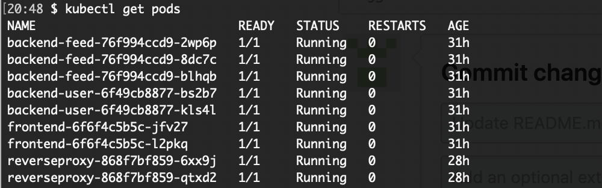
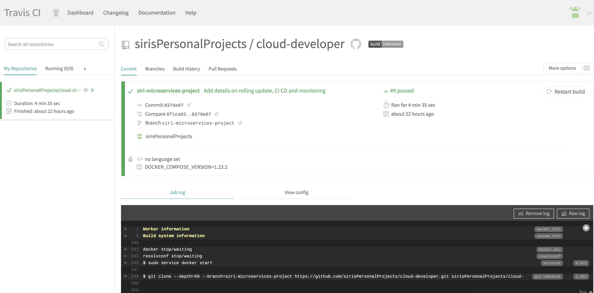
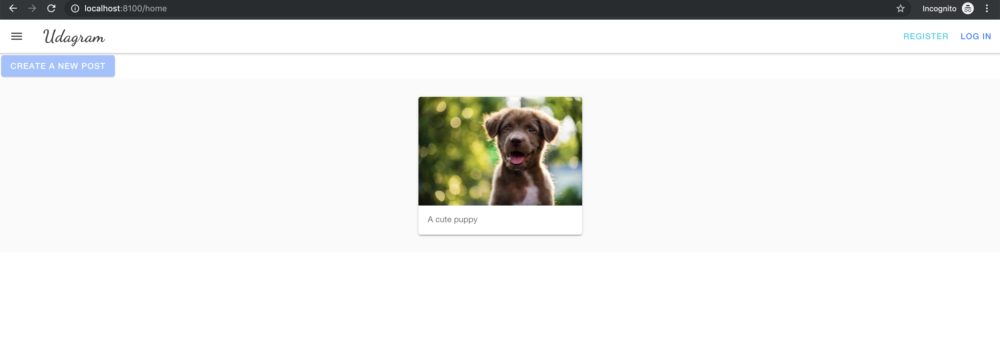

# Intro
This project is developed as part of the udacity cloud developer nanodegree and uses code provided as part of this program.

# Public docker images
The following docker images are published to dockerhub: 

https://hub.docker.com/r/ssingamneni/udagram-frontend

https://hub.docker.com/r/ssingamneni/udagram-reverseproxy

https://hub.docker.com/r/ssingamneni/udagram-restapi-user

https://hub.docker.com/r/ssingamneni/udagram-restapi-feed

# Basic setup

Note: You will need a AWS bucket, RDS instance and your AWS credentials handy.

Export the following variables in your `~/.profile`

```
export POSTGRESS_USERNAME
export POSTGRESS_PASSWORD
export POSTGRESS_DB
export POSTGRESS_HOST
export AWS_BUCKET
export AWS_PROFILE
export AWS_REGION
export JWT_SECRET
export URL

```

`source ~/.profile`

# Starting the app as a container on a local system using docker
Step 1: Pull the images above from dockerhub

Step 2: Clone this repo and checkout branch siri-microservices-project branch

Step 3: cd cloud-developer/course-03/exercises/udacity-c3-deployment/docker

Step 4: docker-compose up

Step 5: You will have a front-end server running at http://localhost:8100 which is accessing the feed as well as the user services which are also running in their own containers


# Starting the app in a kubernetes cluster

I have a kubernetes cluster setup using kubeone (https://github.com/kubermatic/kubeone/blob/master/docs/quickstart-aws.md) on AWS. The cluster has 3 master nodes and 3 worker nodes.

I have deployed the user service, feed service, reverse proxy and frontend as separate microservices that are running on pod deployments in this cluster. Please follow the following steps to access the cluster and check it out.

Step 1: Copy and paste the `udagram-cluster-kubeconfig` file I provided you with in to `cloud-developer/course-03/exercises/udacity-c3-deployment/k8s`

Step 2: `cd cloud-developer/course-03/exercises/udacity-c3-deployment/k8s/` and `export KUBECONFIG=$PWD/udagram-cluster-kubeconfig`

Step 3: Set POSTGRESS_USERNAME and POSTGRESS_PASSWORD in `cloud-developer/course-03/exercises/udacity-c3-deployment/k8s/env-secret.yaml` as base64 encoded strings

Step 4: Set aws creds file in `cloud-developer/course-03/exercises/udacity-c3-deployment/k8s/aws-secret.yaml` as base64 encoded

Step 5: Add the ConfigMaps and Secrets, delete existing ones if any
`kubectl apply env-configmap.yaml`
`kubectl apply -f env-secret.yaml`
`kubectl apply -f aws-secret.yaml`

Step 6: `kubectl get deployment` and make sure backend-feed, backend-user, reverseproxy and frontend exist and are available

Step 7: `kubectl get pods` and make sure all pods are running

Step 8: `kubectl get services` and make sure that backend-feed, backend-user, reverseproxy and frontend services exist

Step 9: Forward the fronend and backend ports
`kubectl port-forward service/frontend 8100:8100`
`kubectl port-forward service/reverseproxy 8080:8080`

Step 10: You should now be able to access the fronend at http://localhost:8100 which has access to feed and user services via the reverse proxy

# Rolling upgrade to a new version

Step 1: If you have new image to be deployed for a service, tag the image as `<image name>:v2 ` and update the appropriate deployment.yaml file with this image name

Step 2: Re deploy
`kubectl apply -f <deployment name>.yaml`

`kubectl get rs` to see the old and the new replica sets. The old replica set is scaled down but remains just in case you want to roll back to the previous version

`kubectl get pod` will show you that the pods for the deployment are restarted with the rolling upgrade

# CI/CD 

Travis CI is integrated with github and is used for continuous integration and deployment. Whenever a new commit is pushed, new images of feed, user, reverseproxy and front are created and they are deployed in a containerized app using docker-compose by creating a container for each image. 
This setup is defined in `cloud-developer/course-03/exercises/udacity-c3-deployment/docker/docker-compose-build.yaml`

Continouous deployment to kubernetes cluster is not enabled yet.

# CloudWatch Monitoring

The AWS CloudWatch EC2 dashboard seems to provide details of CPU utilization and Network details. If there was something else expected for this part, please provide a link to the setup of what's needed.

# Screenshots





