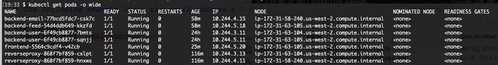
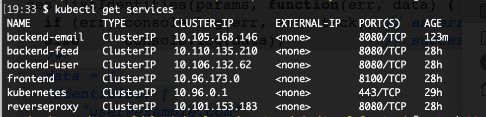
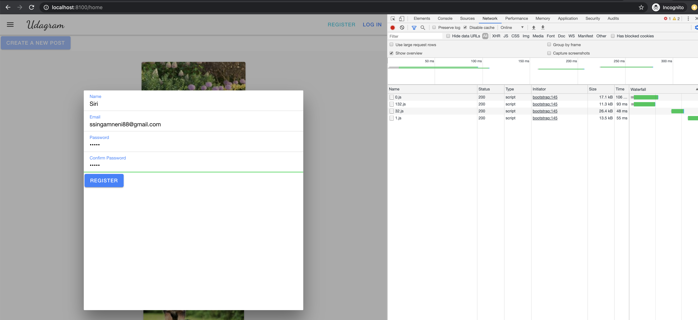
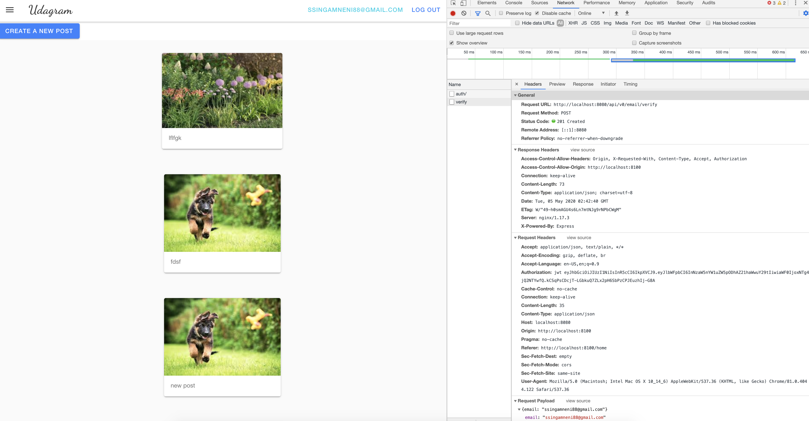
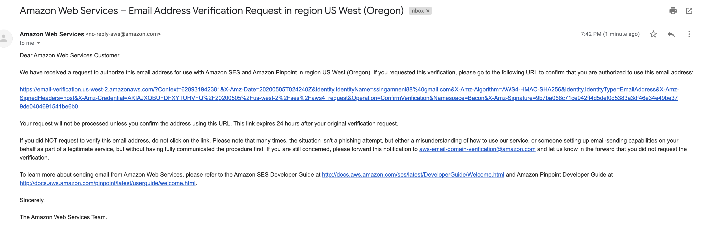
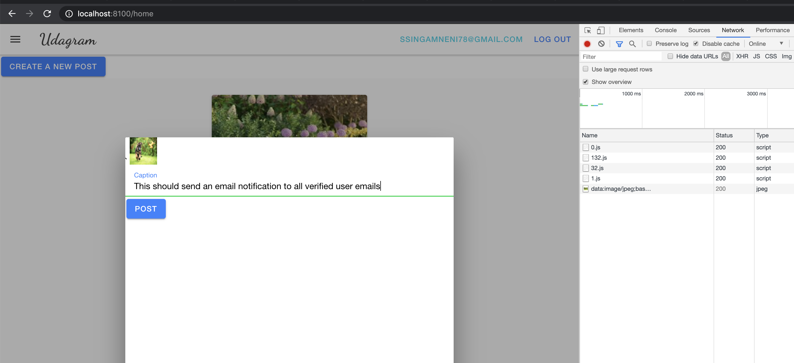
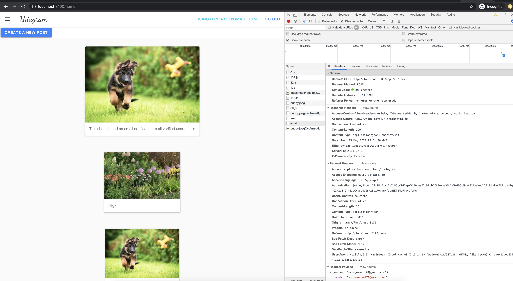
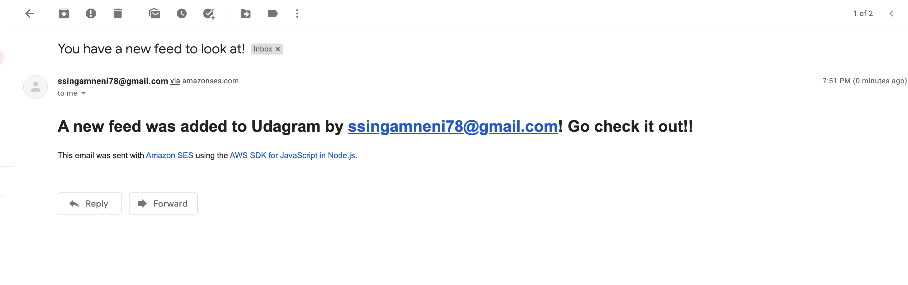
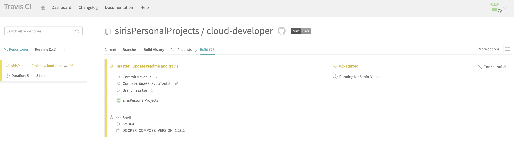
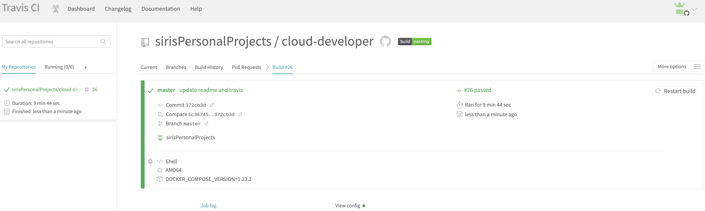

# Introduction and references
This is the capstone project for the Udacity cloud developer nanodegree and forks code provided in Chapter 4 of the course.
(Monolith to Microservices at Scale. Here is the GITHUB repo where it was forked from: https://github.com/scheeles/cloud-developer/tree/06-ci/course-03/exercises).

The app consists of 5 different microservices deployed on a kubernetes cluster. The frontend, reverseproxy, user and feed service already existed in https://github.com/scheeles/cloud-developer/tree/06-ci/course-03/exercises.

The new addition in this project is the email service to enable app notifications. 
When a user registers on the Udagram app, a verification email is sent to the user's email address. When a user adds a new post in Udagram UI, all users in the app that have verified their email addresses will receive a email notification. The email service uses Amazon SES to send notifications.

The AWS docs served as good examples for verifying and sending emails using AWS SES. I specifically used examples from here: 
https://docs.aws.amazon.com/AWSJavaScriptSDK/latest/AWS/SES.html#listIdentities-property
https://docs.aws.amazon.com/ses/latest/DeveloperGuide/examples-send-using-sdk.html

The kubernetes cluster was setup using kubeone: https://github.com/kubermatic/kubeone/blob/master/docs/quickstart-aws.md 

# Notification functionality using screenshots
1 Kubernetes pods running

2 Kubernetes services running

3 App running on kubernetes and verify call when a new user registers

4 Call to email service to verify email on register

5 Verification email received by user

6 Another user logs in and adds a new post

7 Call to email service to send notification emails

8 Email notification received by all users with verified emails

Travis CI pipelines

# Public docker images
The following docker images are published to dockerhub: 

https://hub.docker.com/repository/docker/ssingamneni/udagram-frontend

https://hub.docker.com/repository/docker/ssingamneni/udagram-reverseproxy

https://hub.docker.com/repository/docker/ssingamneni/udagram-restapi-user

https://hub.docker.com/repository/docker/ssingamneni/udagram-restapi-feed

https://hub.docker.com/repository/docker/ssingamneni/udagram-restapi-email

# Running the application

Note: This app needs KUBECONFIG, AWS SES, AWS bucket, RDS instance and AWS credentials.

# Starting the app as a container on a local system using docker
Step 1: Pull the images above from dockerhub

Step 2: Clone this repo and checkout branch master

Step 3: cd cloud-developer/capstone/udacity-c3-deployment/docker

Step 4: docker-compose up

Step 5: You will have a front-end server running at http://localhost:8100 which is accessing the feed, user and email services which are also running in their own containers

# Starting the app in a kubernetes cluster and fowarding to local ports

I have a kubernetes cluster setup using kubeone (https://github.com/kubermatic/kubeone/blob/master/docs/quickstart-aws.md) on AWS. The cluster has 3 master nodes and 3 worker nodes.

I have deployed the user, feed, email, reverse proxy, frontend services as separate microservices that are running on pod deployments in this cluster. These are the steps I followed to setup the kubernetes deployment using this kubeone cluster.

Step 1: Copy and paste the `udagram-cluster-kubeconfig` file I provided you with in to `cloud-developer/capstone/udacity-c3-deployment/k8s`

Step 2: `cd cloud-developer/capstone/udacity-c3-deployment/k8s/` and `export KUBECONFIG=$PWD/udagram-cluster-kubeconfig`

Step 3: Set POSTGRESS_USERNAME and POSTGRESS_PASSWORD in `cloud-developer/capstone/udacity-c3-deployment/k8s/env-secret.yaml` as base64 encoded strings

Step 4: Set aws creds file in `cloud-developer/capstone/udacity-c3-deployment/k8s/aws-secret.yaml` as base64 encoded

Step 5: Add the ConfigMaps and Secrets, delete existing ones if any
`kubectl apply env-configmap.yaml`
`kubectl apply -f env-secret.yaml`
`kubectl apply -f aws-secret.yaml`

Step 6: Create the kubernetes deployments => pods as well as services
`kubectl apply -f backend-feed-deployment.yaml`
`kubectl apply -f backend-user-deployment.yaml`
`kubectl apply -f backend-email-deployment.yaml`
`kubectl apply -f frontend-deployment.yaml`
`kubectl apply -f reverseproxy-deployment.yaml`

`kubectl apply -f frontend-service.yaml`
`kubectl apply -f backend-user-service.yaml`
`kubectl apply -f backend-feed-service.yaml`
`kubectl apply -f backend-email-service.yaml`
`kubectl apply -f reverseproxy-service.yaml` 

Step 7: `kubectl get deployment` and make sure backend-feed, backend-user, reverseproxy and frontend exist and are available

Step 8: `kubectl get pods` and make sure all pods are running

Step 9: `kubectl get services` and make sure that backend-feed, backend-user, reverseproxy and frontend services exist

Step 10: Forward the fronend and backend ports
`kubectl port-forward service/frontend 8100:8100`
`kubectl port-forward service/reverseproxy 8080:8080`

Step 10: I access the fronend at http://localhost:8100 which has access to feed, user and email services via the reverse proxy as you can see in screenshots above.

# CI/CD 

Travis CI is integrated with github and is used for continuous integration and deployment. Whenever a new commit is pushed, new images of feed, user, reverseproxy and front are created and they are deployed in a containerized app using docker-compose by creating a container for each image. 
This setup is defined in `cloud-developer/capstone/udacity-c3-deployment/docker/docker-compose-build.yaml`

Continuous deployment to kubernetes cluster is not enabled because this would need storing KUBECONFIG, AWS, POSTGRESS and other credentials as environment variables in Travis CI which is public. I did not feel safe to expose those, let me know if there is an easier way to do this.

# References
kubeone:
https://github.com/kubermatic/kubeone/blob/master/docs/quickstart-aws.md

AWS SES:
https://docs.aws.amazon.com/AWSJavaScriptSDK/latest/AWS/SES.html#listIdentities-property
https://docs.aws.amazon.com/ses/latest/DeveloperGuide/examples-send-using-sdk.html

user, feed, reverseproxy and frontend code:
https://github.com/scheeles/cloud-developer/tree/06-ci/course-03/exercises
https://github.com/scheeles/cloud-developer
